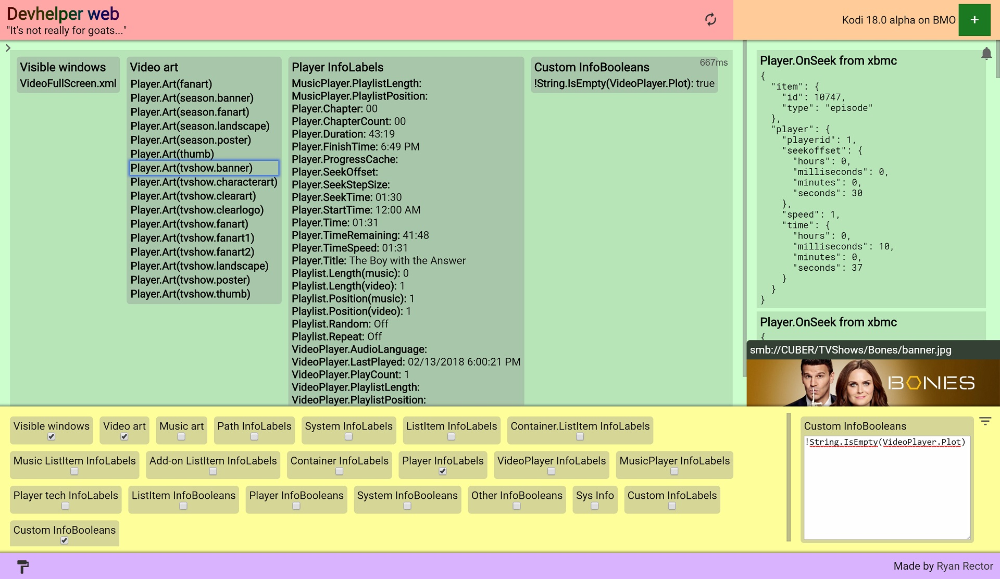
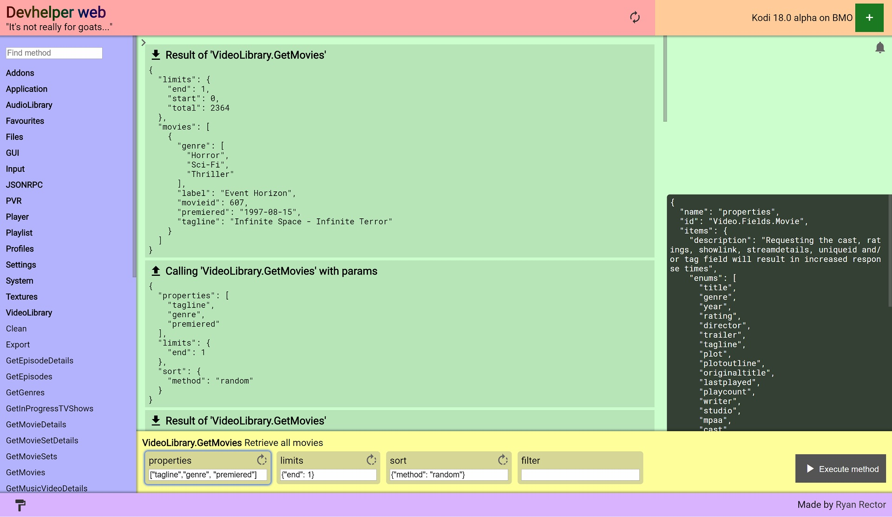

## Devhelper web

A web interface to debug some bits of Kodi. Enable the web server and remote control, then install
and access the web interface at "http://[hostname]:[port]/addons/webinterface.devhelper/", no need to
change the 'Web interface' setting. You can also unpack it and open 'index.html' right from your
local file system without installing it as an add-on, but remote control is still required.

There is a running data section that watches InfoLabels and InfoBooleans available to skins. This
provides access to much of the information that would be used in a debug overlay during skinning,
and there is plenty of room to show more info without obscuring your design.

It also includes a JSON-RPC browser to navigate and execute JSON-RPC methods; a beefed up take on
The Lab in Chorus and [this JSON-RPC browser](https://forum.kodi.tv/showthread.php?tid=172734).

This is still a bit raw, but has been quite useful for me already so I wanted to share. It uses modern
web technologies and requires a modern browser to use. Chrome and Firefox are tested
working, Safari and Opera should also work, but Edge does not. Edge is still missing proper
support for HTML templates; this may be resolved in current Windows insider builds, so shouldn't be long.
